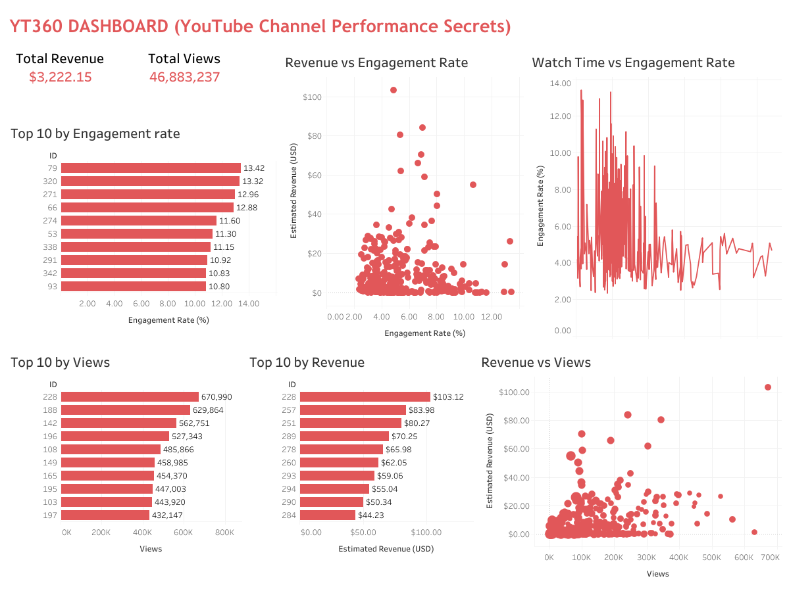

# 📊 YT360 – Unlocking YouTube Channel Performance Secrets

A Fullstack **project**, part of our ongoing **Data Analysis Series**, where we go beyond basic analytics to explore real-world business impact using Python and Tableau.  
In this case, we dive deep into **YouTube video performance** and uncover what truly drives estimated revenue, views, and engagement.

---

## 📁 Repository Structure

- **Cleaned Datasets/**
  - `YT360_Feature_Importance.csv` – Feature importance extracted from ML model  
  - `YT360_Final_Dashboard_Data.csv` – Cleaned dataset for dashboard  
- `Dashboard.png` – Snapshot of the final Tableau dashboard  
- `Dataset` – Raw YouTube dataset  
- `README.md` – Project documentation  
- `Unlocking_YouTube_Channel_Performance_Secrets.ipynb` – Complete jupyter notebook  
- `YT360_YouTube_Performance_Dashboard.twbx` – Tableau packaged workbook  

---

## 🛠️ Tools & Technologies Used

| Type           | Tools / Libraries                            |
|----------------|----------------------------------------------|
| Language       | Python (Pandas, NumPy, Seaborn, Matplotlib)  |
| Visualization  | Tableau (Dashboarding, Filters, Slicers)     |
| ML Modeling    | RandomForestRegressor from Scikit-Learn      |
| IDE/Notebook   | Jupyter Notebook (`.ipynb`)                  |
| Dataset Format | CSV                                          |

---

## 📊 Dataset Overview

- **Source**: Internal YouTube Analytics-style performance data  
- **Total Rows**: 364  
- **Columns**: 70  
- **Date Range**: Multiple months, including publish time

Key metrics include:
- Views, Likes, Shares, Comments
- Watch Time per Impression
- Engagement Rate (%)
- Revenue per View
- Estimated Revenue (USD)

---

## 🎯 Project Objective

> To analyze YouTube channel video performance, identify key revenue drivers, build a predictive model, and design a visual dashboard for content optimization.

---

## 🔄 YT360 Workflow 

### STEP 1: Data Understanding & Cleaning
- Loaded the CSV dataset and explored shapes/types
- Removed nulls, irrelevant columns, and duplicates
- Converted `Video Publish Time` to datetime
- Engineered columns like `Engagement Rate (%)`

### STEP 2: Exploratory Data Analysis (EDA)
- Identified top videos by Revenue, Views, Engagement
- Analyzed distributions of views, revenue, and duration
- Created filtered correlation heatmaps

### STEP 3: Feature Engineering
- Created:
  - `Revenue per View`
  - `Engagement Rate (%)`
  - Watch-to-click metrics
- Normalized where needed for modeling

### STEP 4: Data Visualization (Python)
- Revenue distribution histogram
- Scatter plot: Revenue vs Views
- Bar chart: Watch Time vs Engagement
- Outlier detection using boxplots

### STEP 5: Predictive Modeling
- Built a Random Forest Regressor model
- Features used: Views, Subscribers, Engagement, Revenue per View, etc.
- Split data 80/20 for training/testing
- Evaluation metrics:
  - **R² Score**: `0.94`
  - **RMSE**: `0.02`

### STEP 6: Insights & Recommendations
See [Insights section](#📌-key-insights-from-analysis) below.

---

## 📊 Final Dashboard – Tableau

> 📁 See: `YT360_YouTube_Performance_Dashboard.twbx`

Features:
- KPI Cards: Total Views, Revenue, Engagement Rate
- Bar Chart: Top 10 videos by revenue
- Scatter Plot: Revenue vs Views (bubble size = Engagement)
- Trend Chart: Watch Time per Impression vs Engagement

---

## 📌 Key Insights from Analysis

- **Views** and **Revenue per View** are the strongest predictors of revenue.
- Higher **Engagement Rate (%)** improves monetization potential.
- Videos with high **Watch Time per Impression** show higher earnings.
- Some videos underperform despite high views → low CPM or retention.
- The model explains ~94% of revenue variance (R² = 0.94).

---

## 🧠 Recommendations

|  Area           | Recommendation                                                   |
| ----------------------- | ----------------------------------------------------------------------- |
| **Content Strategy**  | Make videos that get more **likes, shares, and comments**               |
| **Viewer Retention**    | Grab attention in the **first 30 seconds** to keep viewers watching     |
| **Monetization**    | Create videos on **high-paying topics** like tech, finance, or business |
| **Thumbnails & Titles** | Use eye-catching **thumbnails** and **titles** to increase clicks       |
| **Targeted Publishing**              | Post videos when your audience is most active (if data available)       |
| **Shorts/Clips**      | Use **clips and shorts** to reach new viewers and boost engagement      |

---

## 🙋‍♂️ Author

Made by Hashir khan   
Feel free to ⭐ the repo if you found it helpful!

